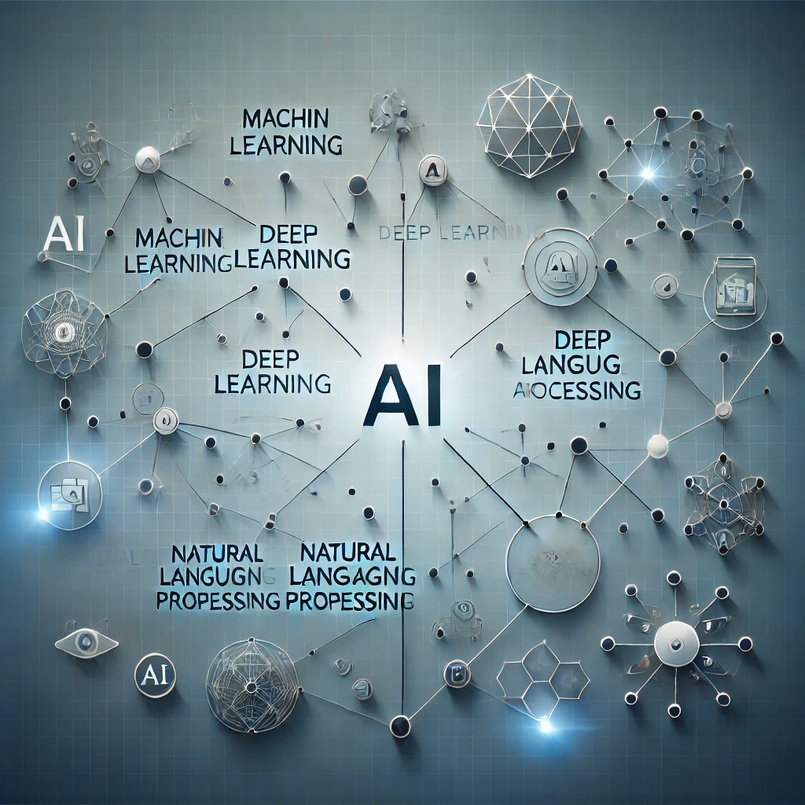

# masters-ai

# First Lecture Recap: Exploring Generative AI

Welcome to the journey of mastering **Generative AI**! Here's a recap of our very first lecture in this fascinating course.

---

## Lecture Highlights

1. **Introduction to Generative AI**:
   - The course is part of a master's program and delves into the exciting world of AI.
   - We explored the fundamentals, including what AI and Machine Learning are.

2. **Instructor's Background**:
   - Our instructor has 13 years of experience in IT, starting as a test automation engineer.
   - Their journey spans teaching roles and leadership in education for junior engineers in Central Asia.

3. **AI in Action**:
   - Discussion about the evolution of AI tools, like GPT-3 and beyond.
   - Introduction to the course structure, covering:
     - Differences between AI and ML.
     - Working with Large Language Models (LLMs).
     - Practical tasks involving Python and tools like Streamlit.

4. **Interactive Insights**:
   - Questions about practical applications, such as using AI models for problem-solving.
   - Emphasis on collaborative learning and sharing knowledge.

---

## Course Structure

- Focus on hands-on learning with coding examples in Python.
- Engaging sessions on LLMs, APIs, and ethical considerations in AI.
- Capstone project to bring concepts together in a real-world application.

---

---

Stay tuned for the next session, where we'll dive deeper into Large Language Models (LLMs) and practical coding tasks.

---
