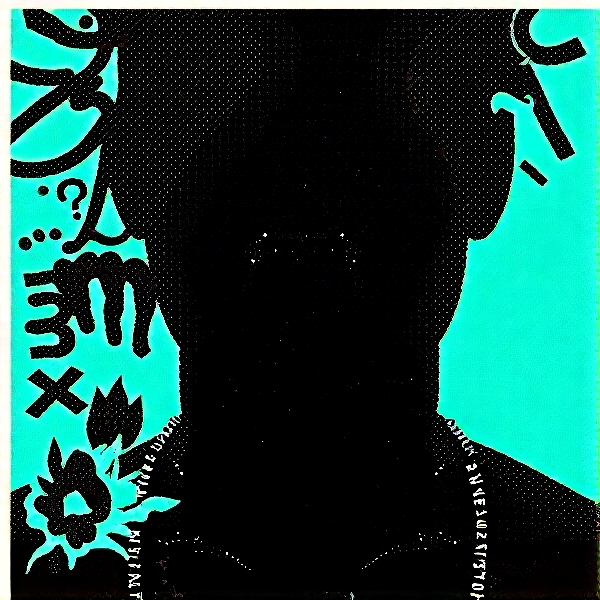
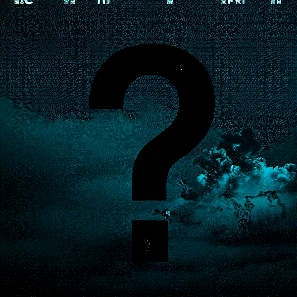
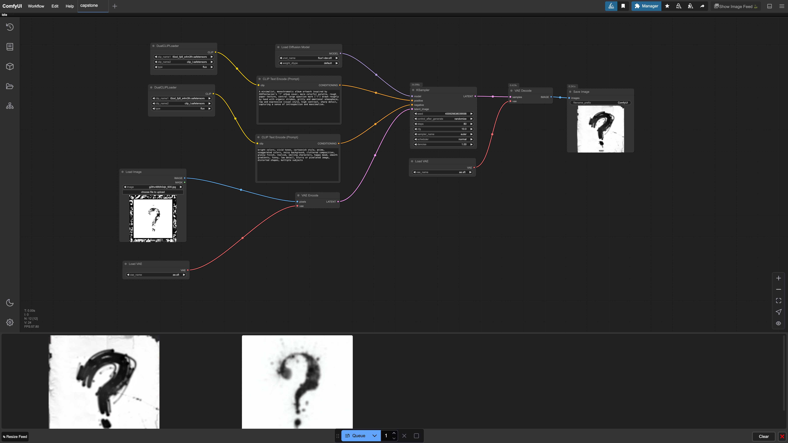
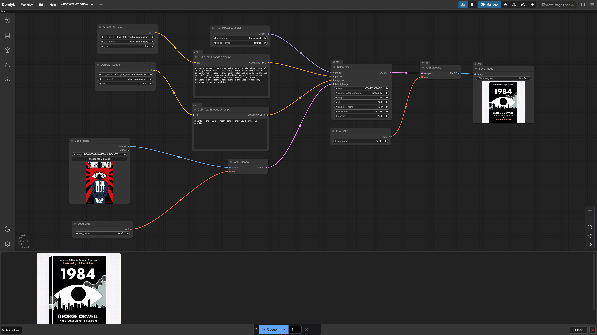
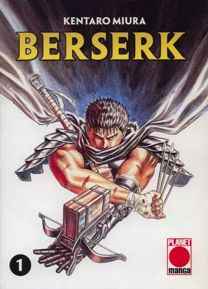
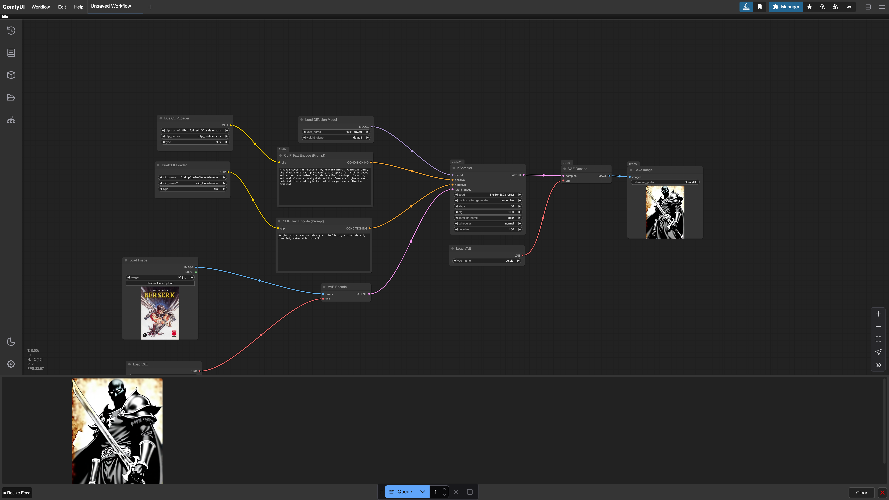
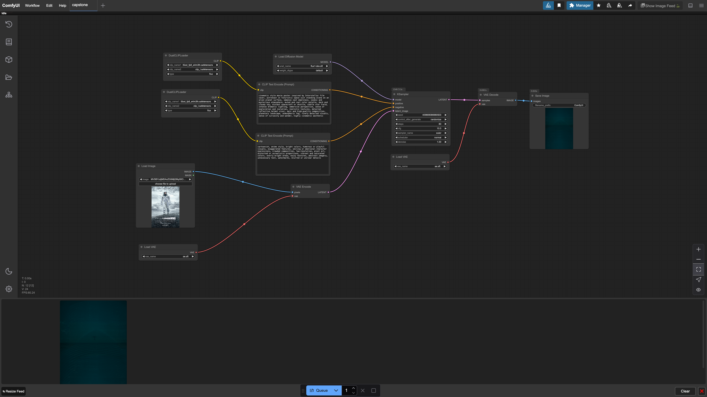

# Capstone Project 

Creating alternative variation of some iconic media, like a book, cd album, vinyl album or DVD box with movie.

## 1 - XXXtentacion '?' music album

### Album cover

### Generated images

 

 

### Worklows and prompt

A minimalist, monochromatic album artwork inspired by XXXTentacion's '?' album cover, more colorfule palette, rough by hand with organic strokes, gritty and emotional atmoshpere, raw and expressive visual style, high  contrast, sharp detail, capturing a sense of in strispection and maxsimalism.

## 2 - 1984 book

### Book cover

### Generated image

### Workfows and prompt

A dystopian and thought-provoking book for the given image of 1984 by George Orwell, featuring themes of surveillance and authortarian control. Incorporate elements such as an ominous watchful eye, cityspaces, and subdued colors like gray and black. The design should evoke a sense of unease and reflection on societal manipulation and loss of freedom, preserve the colors and text.

## 3 - Berserk manga

### Manga cover 

### Manga generated

### Workflows and prompt

A manga civer for 'Berserk' by Kentaro Miura. Featyrubg Guts, the Sowrdsman, prominently with space for a title above and author name below. Include detailed drawings of swords, medieval elements, and gothic motifs. Ensure a high-contrast, colorful, textured stule typical of manga covers.

# 4 - Interstaller movie

### Movie cover

### Movie generated 

### Workflows and prompt 

cinematic style movie poster inpired by Interstellar film cover, astronaut in futuristic space suit standing alone on an alien planet surface, immense vast emptiness, cosmic and mysterious atmosphere, muted and cool color palette, dark and cloudy sky, distant spacecraft or shuttle, subtle star field, instense dramatic lighting, immersive perspective, sense of exploration and isolation, realistic textures, detailed reflective helmet visor, epic and high-quality composition, planetary landspace, atmostheroc fog, finely detailed visuals sense of curiosity and wonder, highly cinematic aesthetic